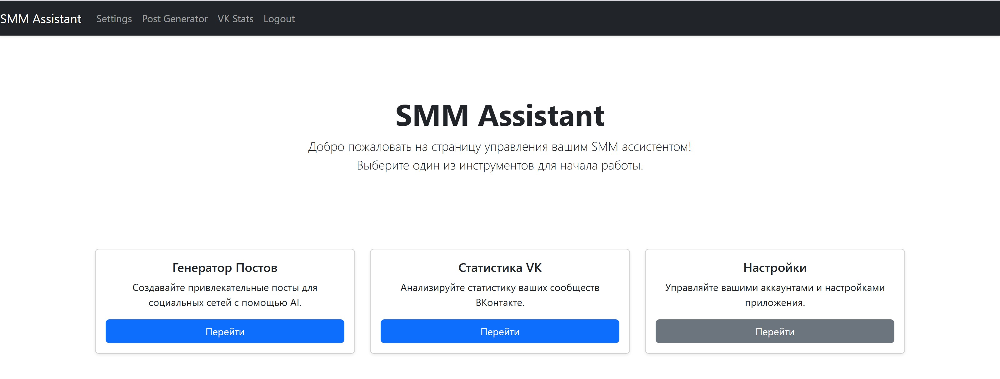
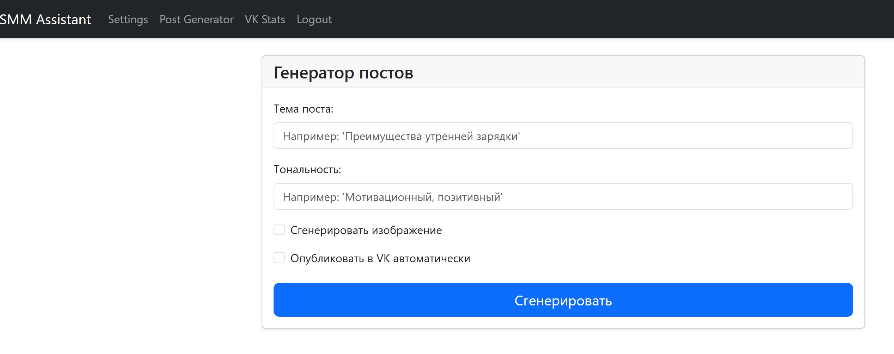
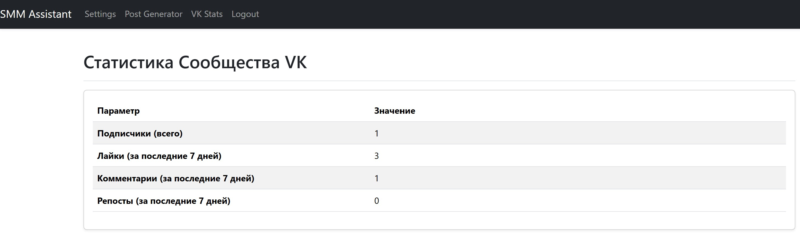
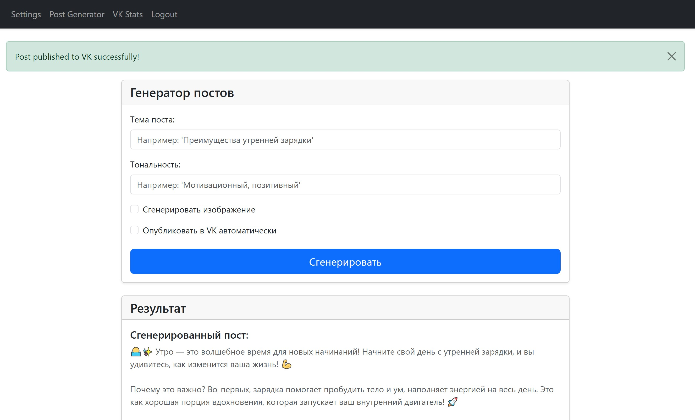
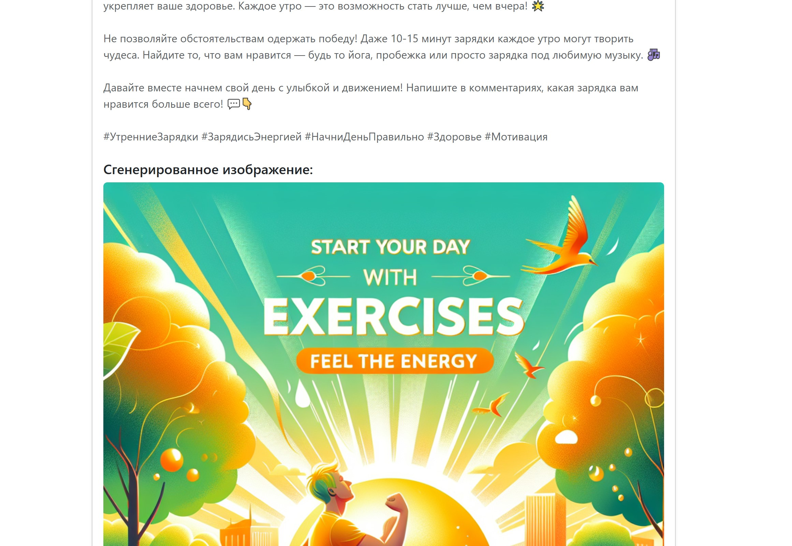
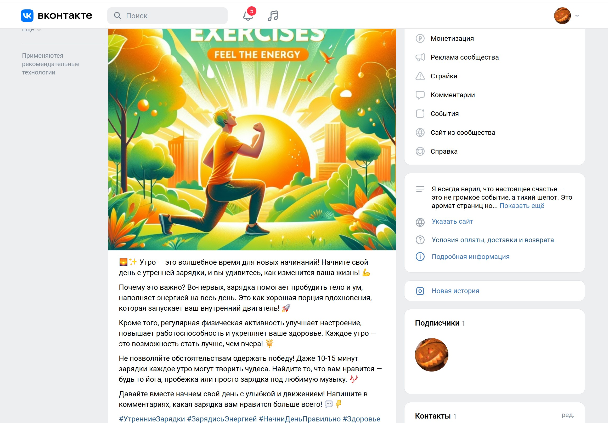

# SMM-ассистент со встроенным ИИ, способный генерировать посты и картинки, а также работать с API социальных сетей. 

  
  
  
  
  
  
  

## 📌 О проекте  

**SMM Assistant** — это веб-приложение для автоматизации работы с соцсетью **ВКонтакте**.  
Проект сочетает генерацию текстов и изображений с помощью **OpenAI API**, планирование и автопубликацию постов, а также сбор статистики по сообществам.  

### 🔑 Основные возможности:  
- Регистрация и авторизация пользователей с надёжным хэшированием паролей с помощью Bcrypt. Все API-ключи пользователя надёжно хранятся в базе данных..  
- Хранение данных о пользователях и ключах в базе (**SQLAlchemy**).  
- Панель управления (**Dashboard**) для настройки **VK API** ключа и ID группы.  
- Генерация постов с помощью **OpenAI GPT** (тональность и тема задаются пользователем).  
- Создание изображений для постов (OpenAI DALL·E).  
- Автоматическая публикация постов в сообщество ВКонтакте.  
- Просмотр статистики (подписчики, лайки, комментарии, репосты).  
- Чистый и адаптивный интерфейс, построенный на Bootstrap 5, делает работу с приложением быстрой и удобной.  

### 🤔 Как это работает
1. **Настройка:** Пользователь регистрируется и вводит в настройках свой API-ключ от VK и ID группы.

2. **Генерация:** На странице "Генератор постов" пользователь задаёт тему и тональность будущего поста.

3. **Выбор опций:**

  - Отмечает чекбокс **"Сгенерировать изображение"**, если к посту нужна картинка.

  - Отмечает чекбокс **"Автопубликация в VK"**, чтобы сразу отправить готовый пост в сообщество.

4. **Результат:**

- Если **"Автопубликация"** выбрана, пост мгновенно появляется на стене сообщества.

- Если опция не выбрана, сгенерированный текст и изображение появляются на экране, чтобы пользователь мог скопировать их и использовать по своему усмотрению.
---

## ⚙️ Используемые технологии

- [Python 3.11](https://www.python.org/)  
- [Flask](https://flask.palletsprojects.com/)  
- [Flask-Login](https://flask-login.readthedocs.io/)  
- [Flask-WTF](https://flask-wtf.readthedocs.io/)  
- [SQLAlchemy](https://www.sqlalchemy.org/)  
- [Bootstrap 5](https://getbootstrap.com/)  
- [OpenAI API](https://platform.openai.com/)  
- [VK API](https://dev.vk.com/api)  

## 📂 Структура проекта
```bash
ZeroVK_SMM/
│
├── app/
│   ├── __init__.py          # инициализация Flask-приложения
│   ├── models.py            # модели SQLAlchemy
│   ├── forms.py             # Flask-WTF формы
│   ├── smm.py               # маршруты для SMM
│   ├── templates/           # HTML-шаблоны (dashboard, post_generator, vk_stats)
│   └── static/              # статика (css, js)
│
│── instance/
│   ├── site.db              # база данных
├
├── generators/
│   ├── text_gen.py          # генератор текста (OpenAI)
│   └── image_gen.py         # генератор картинок (OpenAI)
│
├── social_publishers/
│   └── vk_publisher.py      # публикация постов в VK
│
├── social_stats/
│   └── vk_stats.py          # получение статистики VK
│
├── config.py                # конфигурация проекта
├── app.py                   # точка входа
└── requirements.txt         # зависимости
```

## 🚀 Запуск проекта

1. Клонируйте репозиторий:  
   ```bash
   git clone https://github.com/username/ZeroVK_SMM.git
   cd ZeroVK_SMM
   ```

2. Создайте виртуальное окружение и активируйте его:  
   ```bash
   python -m venv .venv
   source .venv/bin/activate   # для Linux/Mac
   .venv\Scripts\activate    # для Windows
   ```

3. Установите зависимости:  
   ```bash
   pip install -r requirements.txt
   ```

4Настройте конфигурацию:
- Переименуйте файл ```config.py.example``` в ```config.py```.
- Откройте ```config.py``` и укажите ваш ```OPENAI_API_KEY```.

Примечание: Ключ OpenAI задаётся централизованно в конфигурации и не может быть изменён пользователем в интерфейсе.

5. Запустите миграции БД:  
   ```bash
   flask db init
   flask db migrate -m "Initial migration"
   flask db upgrade
   ```

7. Запустите приложение:  
   ```bash
   flask run
   ```

8. Откройте в браузере: [http://127.0.0.1:5000](http://127.0.0.1:5000)

---

## 🌍 Деплой

Приложение разработано с учётом возможности хостинга на платформе PythonAnywhere.

---

## 📸 Скриншоты



**Панель управления Ассистентом**

---


**Генератор постов**

---



**Статистика**

---



---


---



**Результат генерации**

---


